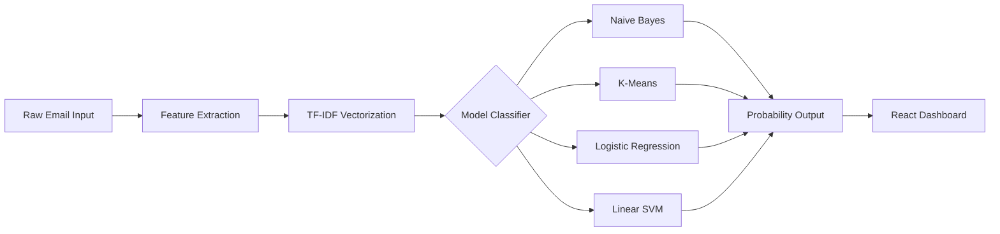

# 🛡️ AI-Powered Email Spam Detector

[](https://reactjs.org/)
[](https://fastapi.tiangolo.com/)
[](https://scikit-learn.org/)
[](https://d3js.org/)
[](https://mui.com/)

> **COS30049 - Cloud Computing** | Swinburne University of Technology

A full-stack machine learning application designed to inspect suspicious emails, classify them as Spam or Ham, and visually explain the model's reasoning. This project satisfies the High Distinction (HD) requirements for Assignment 3 by seamlessly integrating interactive D3.js data visualizations with a robust AI classification pipeline.

---

## ✨ Key Features

- **Multi-Model Support**: Instantly switch between `Naive Bayes`, `K-Means Clustering`, `Logistic Regression`, and `Linear SVM` to see how different algorithms classify the same text.
- **Rich Interactive Visualizations**:
  - **Feature Radar Chart**: An interactive D3.js chart that morphs and plots your email's numeric features against the training dataset's Spam/Ham averages. Includes hover tooltips and an interactive legend.
  - **Sentence Spam Highlighter**: A heatmap that color-codes individual sentences based on their toxicity/spam probability.
  - **Grouped Bar Charts & Word Clouds**: Specifically designed for summarizing Batch CSV uploads.
- **Flexible Input Methods**:
  - **Raw Text Paste**: Quick copy-paste analysis.
  - **File Upload**: Native support for parsing `.eml`, `.msg`, and `.txt` files.
  - **Batch CSV Analysis**: Upload thousands of emails at once to generate a macro-level dashboard of model predictions and top spam keywords.
- **Export Ready**: Clean, CSS-optimized PDF and PNG report exporting that ensures layout integrity without cutting components in half.

## 🧠 Machine Learning Architecture

The AI engine relies on a robust NLP pipeline utilizing TF-IDF vectorization and 9 custom feature extractors (e.g., URL counts, Exclamation marks, Capitalization ratios). 

[🔗 Access our Training Dataset on SharePoint](https://liveswinburneeduau-my.sharepoint.com/:f:/g/personal/105292899_student_swin_edu_au/IgArWPNGyw_GTa-5LNHZSanxAT9Ok7633LuMn-NqIE9SUz0?e=axdxlL)



## 🛠️ Project Setup & Installation

### Option A: Run with Docker (Recommended)

The easiest way to spin up the entire application is using Docker Compose. Ensure Docker is running on your machine, then execute:

```bash
docker-compose up --build
```

- **Frontend Dashboard**: `http://localhost:80` (or simply `http://localhost`)
- **Backend API**: `http://localhost:8000`

### Option B: Manual Local Setup

If you prefer to run the components separately for development:

#### 1. Start the Backend (FastAPI)

The backend handles all Python-based Machine Learning inference.

```bash
cd email-spam-detection-backend
python -m venv .venv
source .venv/bin/activate  # On Windows use: .venv\Scripts\activate
pip install -r requirements.txt
uvicorn app.main:app --reload
```
*The API will be available at `http://localhost:8000`*

#### 2. Start the Frontend (React)

The frontend powers the interactive UI and D3 visualizations.

```bash
cd email-spam-detection-web-app
npm install
npm run dev
```
*The Dashboard will be available at `http://localhost:5173`*

---

## 👨‍💻 Team
*(Note: Be sure to update your exact team member names in `HomePage.jsx` if needed)*
- Lead AI Engineer
- Frontend Developer
- Backend Developer
